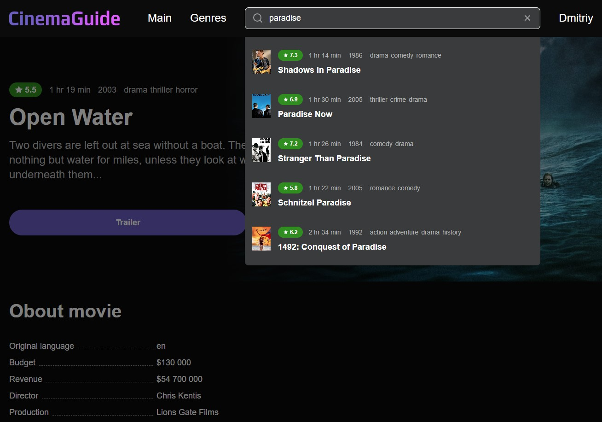

# Гайд по фильмам "Cinema Guidle"

## Скриншоты
|  |  |
| - | - |
|  |  |
| - | - |
|  |  |

## Технологии

- Vue 3 Composition API
- Vue-router
- Pinia
- Vite
- TypeScript
- Scss
- Axios
- Swiper.js
- vue-focus-lock

## Функционал

- Показ случайного фильма и списка из 10 фильмов с высоким рейтингом на главной странице.
- Каждому фильму соответствует детальная страница с подробным описанием и модальным окном для просмотра трейлера.
- Поиск фильмов по названию с отображением результатов в модальном окне.
- Страница с жанрами, с возможностью выбора фильмов по жанрам.
- Авторизация и регистрация пользователей.
- Авторизованные пользователи могут добавлять и удалять фильмы из избранного.
- Личный кабинет с информацией о пользователе и списком его избранных фильмов.
- Блокировка возможности перехода в личный кабинет неавторизованным пользователям через адресную строку.
- Модальные окна блокируют выход фокуса за их пределы и обеспечивают удобную навигацию с клавиатуры.
- Адаптивная верстка: использованы медиа-запросы, Grid и Flexbox для обеспечения оптимального отображения на различных разрешениях экрана


## Демо
https://dmitriy153612.github.io

## Запуск проекта

```bash
# Установка зависимостей
npm install

# Запуск проекта в режиме разработки с hot-reload
npm run dev

# Компиляция проекта для prodaction
npm run build